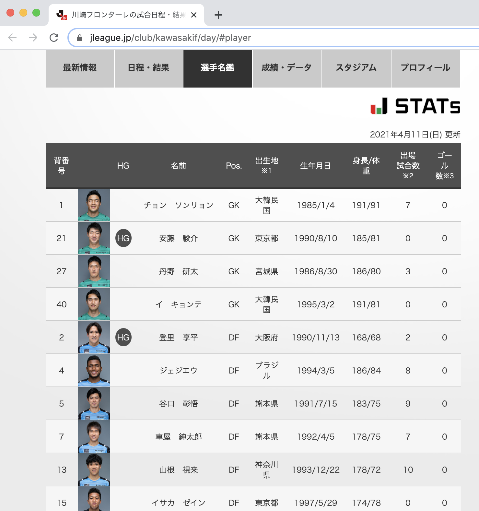
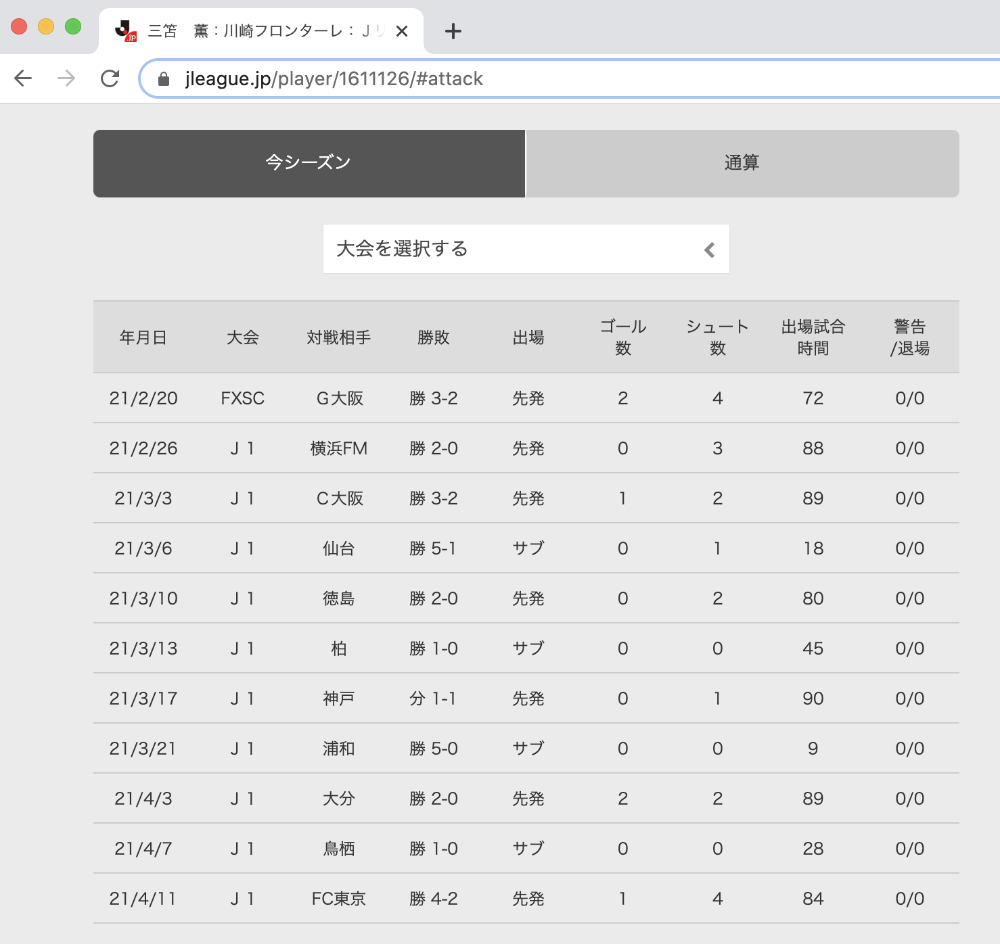

# [Jリーグ公式サイト](https://www.jleague.jp)から各チームの選手一覧とシーズン成績をスクレイピング

## やってること

例えば[川崎フロンターレのページ](https://www.jleague.jp/club/kawasakif)を例に出すと、

まず、[選手名鑑のタブ](https://www.jleague.jp/club/kawasakif/day/#player)にあるテーブル情報を取得してcsvにします。


その後、各選手の行をクリックした先にある[選手ページ](https://www.jleague.jp/player/1603854/#attack)のシーズン成績のテーブルも取得し、csvにします。ファイル名は選手名_背番号.csvの形式です。



## 前提
- Python
- pip
- ChromeDriver

## ChromeDriverの準備

seleniumも使っているのでChromeDriverが必要になります。
[こちら](https://sites.google.com/a/chromium.org/chromedriver/downloads)から適当なバージョンのドライバーをインストールしてそのパスをconfig.ymlに記述してください。デフォルトはルートディレクトリ直下になっています。

```yml:config.yml
driver_path: ./chromedriver
```

## 依存ライブラリインストール

```sh
$ pip install -r requirements.txt
```

## 実行

```sh
$ python gen_table.py ${出力先フォルダ} ${チームURL}
```

チームURLは`https://www.jleague.jp/club/***`の形式です。[この辺のページ](https://www.jleague.jp/standings/j1/)からたどって取得してみてください。

例えば川崎フロンターレだと`https://www.jleague.jp/club/kawasakif`になりますので、このように実行します。

```sh
$ python gen_table.py ./kawasaki https://www.jleague.jp/club/kawasakif
```